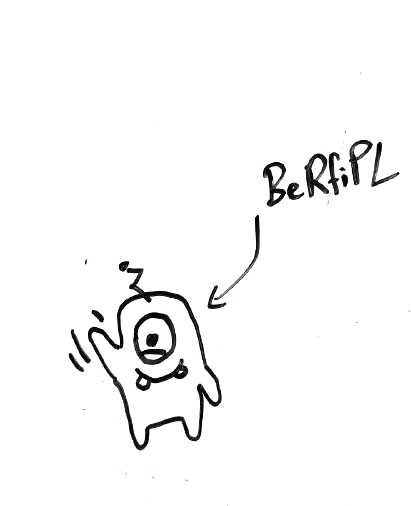

# AI Benchmark for Diagnosis Reconfiguration and Planning

This repository contains the simulation models for the AI Benchmark for Diagnosis, Reconfiguration and Planning (BeRfiPl).
The simulated datasets can be downloaded The benchmark datasets can be downloaded [here](https://drive.google.com/drive/folders/1YnBZINzUTqHmP_xtuc64yyAbWNFHelY0?usp=sharing).

## Motivation 

To improve the autonomy of Cyber-Physical Production Systems (CPPS), a growing number of approaches in Artificial Intelligence (AI) is developed.
However, implementations of such approaches are often validated on individual use-cases, offering little to no comparability. 
Though CPPS automation includes a variety of problem domains, existing benchmarks usually focus on single or partial problems. 
Additionally, they often neglect to test for AI-specific performance indicators, like asymptotic complexity scenarios or runtimes. 
We introduce a comprehensive benchmark, offering applicability on diagnosis, reconfiguration, and planning approaches from AI. 
The benchmark consists of a grid of datasets derived from 16 simulations of modular CPPS from process engineering, featuring multiple functionalities, complexities, and individual and superposed faults.


## Requirements
A virtual environment with the requirements to run the python scripts can be generated from the `venv_benchmark.yml` file. 
Additionally, [OpenModelica](https://openmodelica.org/) has to be installed.

`Modelica=3.2.3`

(`OMEdit`)

`Python~=3.8`

`pandas~=1.4.1`

(`plotly~=5.6.0`)


## Quickrun 

Running `./scripts/create_benchmark.py` in your terminal.
The datasets will be saved into the `./datasets` directory.

**or** 

Open single models and superModels in OMEdit and run the simulation manually.


# Models

The benchmark consists of four different component modules (mixer, filter, distill, bottling) with different functionalities (cf. Fig.1).
The modules can be interchangeably combined to simulate modular process plants with differing functionalities.


*Fig.1: Four modules with different functionalities: a) filter, b) mixer, c) distill, d) bottling*

For the benchmark, connection models of 12 different CPPS are predefined in `benchmark_config.json`, forming a comprehensive selection of datasets for validating AI algorithms on diagnosis, reconfiguration and planning (cf. Fig. 2).


*Fig.2: CPPS combinations for the benchmark*


## Information

For a full introduction, you can read the [documentation](https://j-ehrhardt.github.io/benchmark-for-diagnosis-reconf-planning/docs/general/berfipl_intro.html).

This benchmark was developed at the chair if Informatics in Engineering at Helmut-Schmidt-University, Hamburg. 
For questions please contact: **jonas.ehrhardt(at)hsu-hh.de** and **malte.ramonat(at)hsu-hh.de**.

When using this benchmark please cite: 
```
@INPROCEEDINGS{9921546,
  author={Ehrhardt, Jonas and Ramonat, Malte and Heesch, René and Balzereit, Kaja and Diedrich, Alexander and Niggemann, Oliver},
  booktitle={2022 IEEE 27th International Conference on Emerging Technologies and Factory Automation (ETFA)}, 
  title={An AI benchmark for Diagnosis, Reconfiguration & Planning}, 
  year={2022},
  volume={},
  number={},
  pages={1-8},
  organization = {IEEE},
  doi={10.1109/ETFA52439.2022.9921546}}
```


## LICENSE

Licensed under the Apache License, Version 2.0 (the "License"); you may not use it except in compliance with the License. A copy of the License is included in the project, see the file LICENSE.**


  
