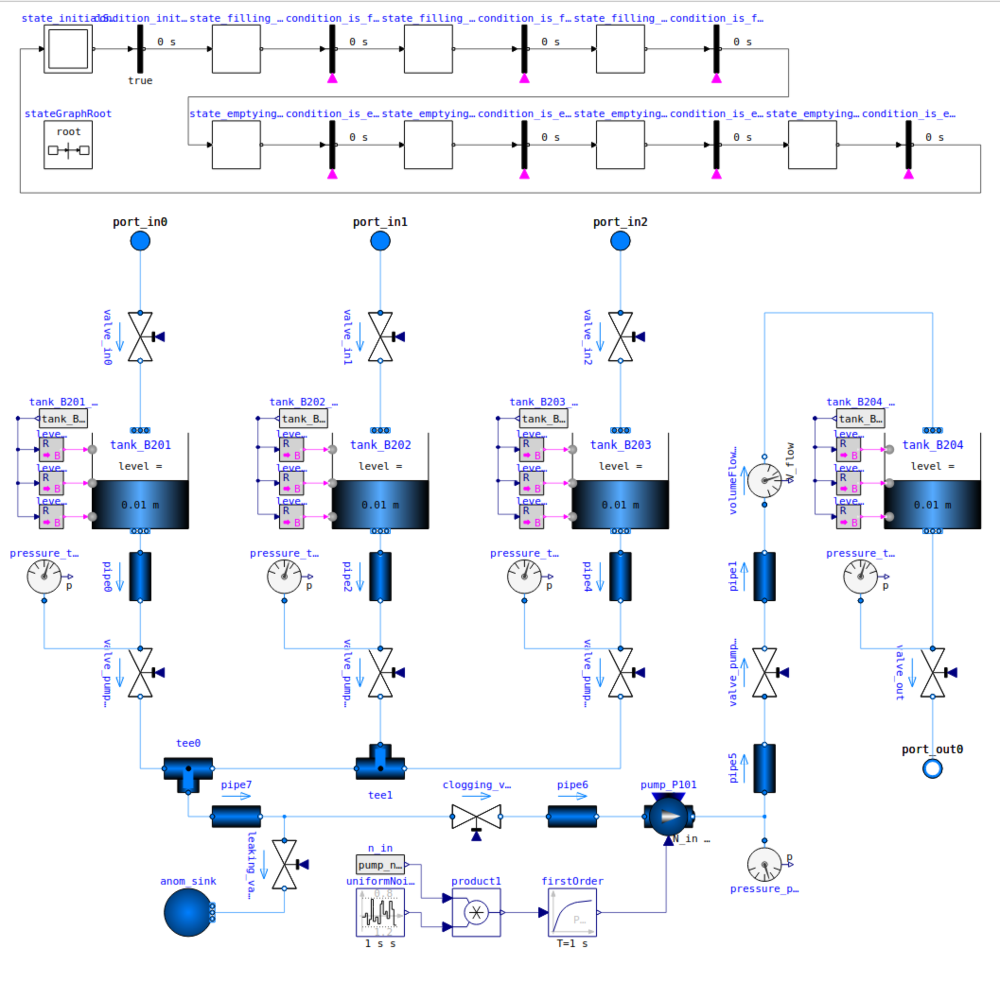
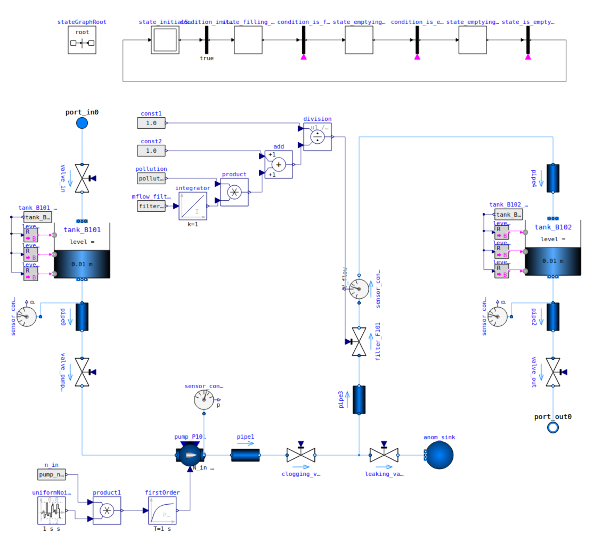
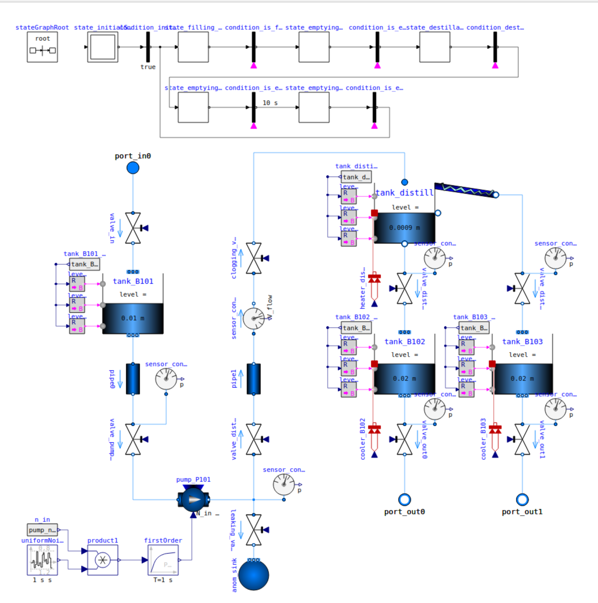
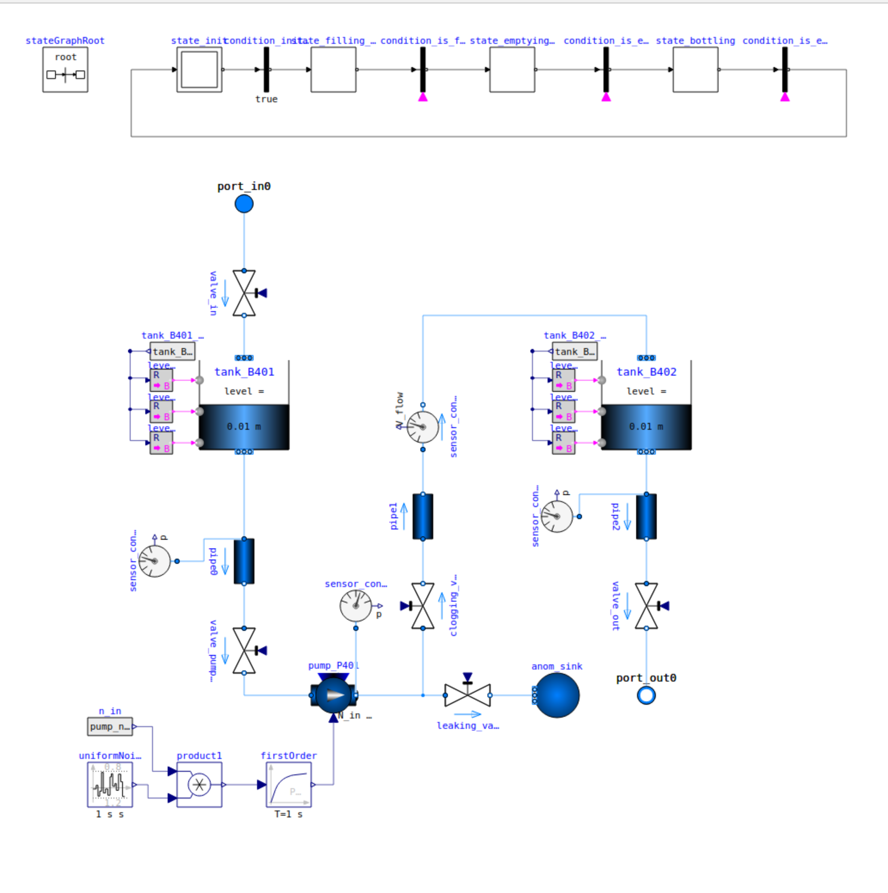

[](https://www.python.org/downloads/release/python-3120/)
[](https://mamba.readthedocs.io)
[]()
[](LICENSE)


# Hamburg AI Benchmark for Cyber-Physical Systems (HAI-CPS)

The **Hamburg AI Benchmark for Cyber-Physical Systems (HAI-CPS)** is a comprehensive dataset for evaluating AI models for **anomaly detection, diagnosis, reconfiguration, and planning** in modular process plants. It provides:

- OpenModelica simulation models for creating your own scenarios
- Pre-simulated datasets for benchmarking
- Docker integration for easy execution

> [!NOTE]
> This benchmark extends the **Benchmark for Diagnosis, Reconfiguration, and Planning (BeRfiPl)**. You can access the previous version [here](https://github.com/j-ehrhardt/benchmark-for-diagnosis-reconf-planning/tree/benchmark_v1).

> [!WARNING]
> The HAI-CPS is still under development. A release is planned for February 2025. 

## Table of Contents
1. [Introduction](#hamburg-ai-benchmark-for-cyber-physical-systems-hai-cps)
2. [Requirements](#requirements)
3. [Installation](#installation)
4. [Using the Simulation Models](#using-the-simulation-models-)
   - [Creating Your Own Simulations](#creating-your-own-simulations)
   - [Recreating the Benchmark](#recreating-the-benchmark)
5. [Overview](#overview)
6. [Citation](#citation)


# Requirements

**For local use**:

> Local usage has only been tested on Ubuntu 22.04 LTS and Ubuntu 24.04 LTS. While the models should work without a problem in the OpenModelica Shell or OpenModelica Editor, the Python API might have problems.

- For running the benchmark you need OpenModelica `4.0.0`.
- All other requirements can be found in the `venv.yml` file. 


**Using Docker:**

- If you want to run the simulation from within the Docker container, you need a current version of Docker and Docker Compose.


# Installation 

**For local use:**

Install OpenModelica by following the install instruction from the [OpenModelica website](https://openmodelica.org/download/download-linux/).

For installing all other requirements, install a current version of Mini-Forge and type the following into your terminal: 
```bash
mamba env create -f env.yml
```

**Using Docker:**

Set up the docker container via the `Dockerfile`, by navigating into the directory, where the `Dockerfile` lives and enter: 
```bash
docker compose up -d
```


# Using the Simulation Models 
You can use the code and models from this repository in two ways. 
Either, you simulate your own scenarios or you recreate the benchmark.

> In addition to the OpenModelica models there are FMU exports of each module for usage in OpenModelica, Simulink, or other simulation environments.

### Creating Your Own Simulations

If you want to create your own simulations, you can either use the OpenModelica Editor (OMEdit) to construct your own scenarios and setups of CPS, or you use the python interface provided in this repository.

When using the OMEdit, simply load the models from the `models` directory and assemble them into new configurations in the `ProcessPlant.mo` file.

When using the Python interface, create your unique setup as a `config.json` and run the `sim.py` file with the provided virtual environment. (This is especially suited for the docker usage). 
You can orient yourself on the setup file for the benchmark `benchmark_setup.json` in the `code` directory.

FMU exports of the models are in the `models_fmu` directory, in case you want to use another simulation framework. 

### Recreateing the Benchmark 

If you simply want to simulate all datasets from the benchmark run the `sim.py` file with teh virtual environemtn activated. 
The script will automatically select the `benchmark_setup.json` file and run all simulations.

# Overview 

## Models

The benchmark consists of models and simulated time-series data of a modular process plant. 
There are four individual modules: Mixing, Filtering, Distilling, and Bottling. 
The modules can be interconnected, and simulated arbitrarily for your own purposes.


### Modules
You can find the OpenModelica models for the four different modules a) Filter, b) Mixer, c) Distill, d) Bottling in the `models` along with auxilliary modules, like sources or sinks.

|    |    |
|-------------------------------------------|--------------------------------------------|
|  |  |

### Anomalies 
All modules have can simulate different anomalies. 
While some anomalies only affect the modules, some propagate directly and indirectly into other modules. 


- Leaking Anomaly: **The leaking valve is opened and a continuous volume flow is diverted into a separate sink and vanishes from the system.**

- Clogging Anomaly: **The clogging valve is partially closed to impede the the volume flow.** 

- Pump Lower Performance 90%: **The pump is only working on 90% of its actual performance.**

- Pump Lower Performance 70%: **The pump is only working on 50% of its actual performance.**

- Pump Noise in Performance: **Noise is injected into the RPM of the pump.**

- Inlet Valve Anomaly: **The inlet valve cannot close completely and remains opened at 10%**

- Outlet Valve Anomaly: **The inlet valve cannot close completely and remains opened at 10%**

- Filter Pollution Anomaly: **The filter pollution at start ist already set to 50%**


## Benchmark 
The idea of the benchmark is to offer a comprehensive dataset for Machine Learning Algorithms for technical system. 
The setup allows to evaluate and compare algorithms systematically in the dimensions of system complexity and problem complexity. 

There are different modes of the benchmark datasets:

- **discrete mode** only discrete values from the process plant will be recorded. 
- **continuous mode** only continuous values from the process plant will be recorded. 
- **hybrid mode** all values from the process plant will be recorded. 
- **including states** the states from the automatons running the individual models will be included. 

Below is an image of all twelve standard setups of HAI-CPS.


# Citation 

The original benchmark was developed at the chair if Informatics in Engineering at Helmut-Schmidt-University, Hamburg. 
For questions please contact: **jonas.ehrhardt(at)hsu-hh.de** and **malte.ramonat(at)hsu-hh.de**.

When using the original benchmark please cite: 
```bibtex
@INPROCEEDINGS{Ehrhardt2022,
  author={Ehrhardt, Jonas and Ramonat, Malte and Heesch, René and Balzereit, Kaja and Diedrich, Alexander and Niggemann, Oliver},
  booktitle={2022 IEEE 27th International Conference on Emerging Technologies and Factory Automation (ETFA)}, 
  title={An AI benchmark for Diagnosis, Reconfiguration & Planning}, 
  year={2022},
  pages={1-8},
  organization = {IEEE},
  doi={10.1109/ETFA52439.2022.9921546}}
```

## LICENSE
Licensed under [MIT license](LICENSE).
