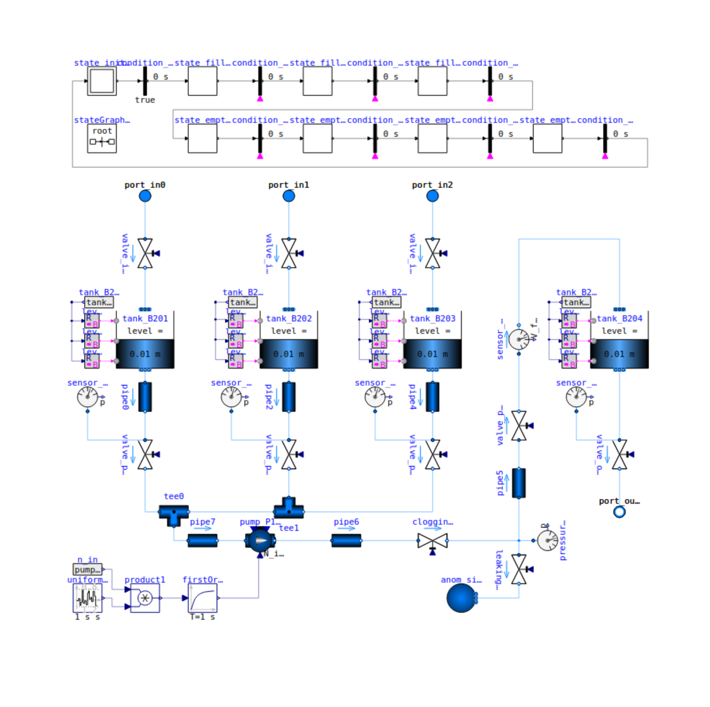
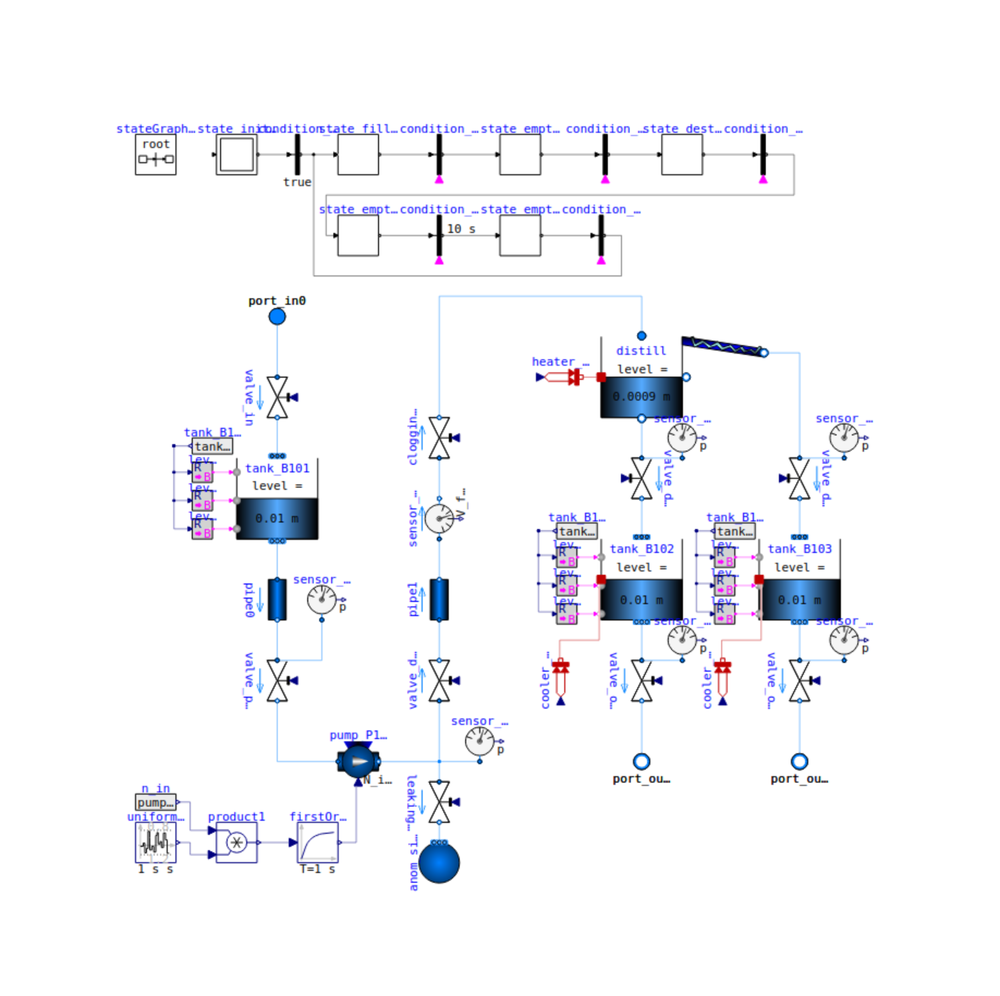
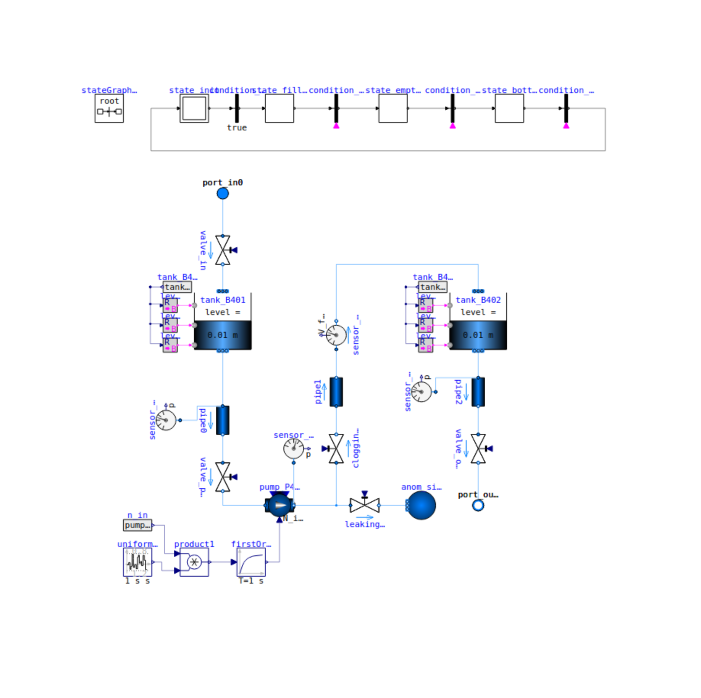
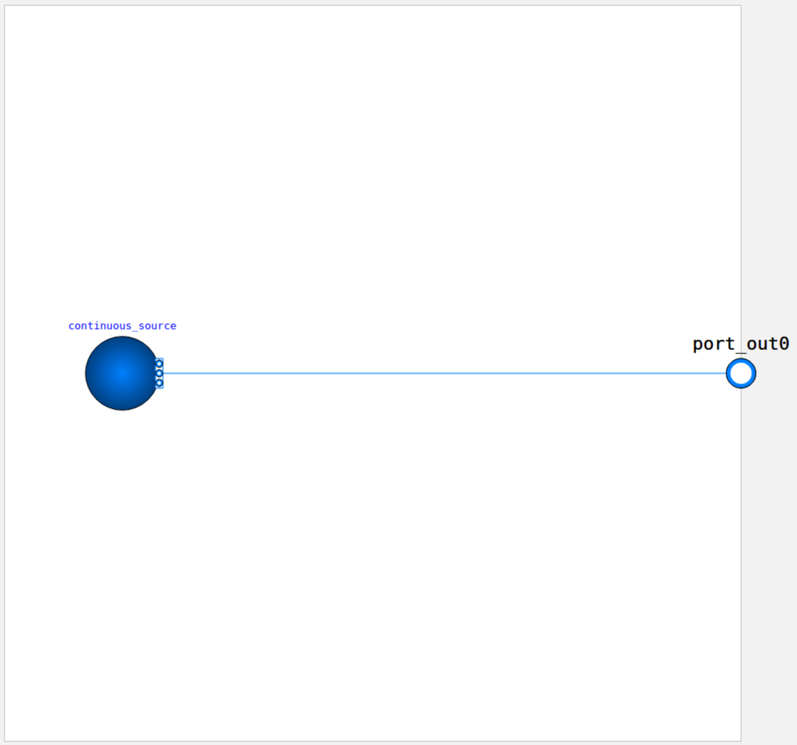
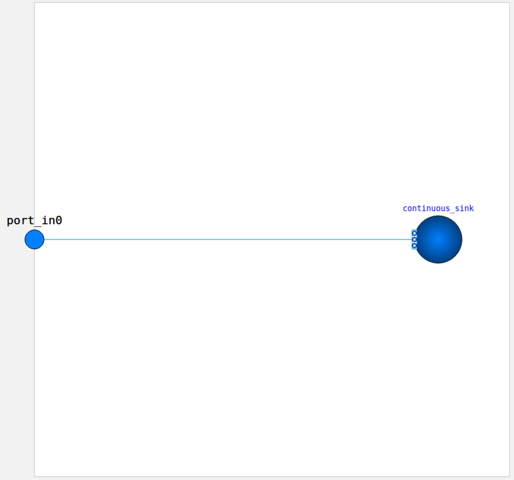

# CPS Modules

The HAI-CPS benchmark consists of ten datasets derived from different configurations of a modular Cyber-Physical Process plant.  
The process plant features four types of modules that can be interconnected in various ways.  
Each module is implemented as an OpenModelica model containing multiple components and controlled by its own automaton.

To enhance the realism of the simulation data, stochastic noise has been introduced into the pump rotational speed (RPM), resulting in fluctuations in volume flow throughout the system. This addition better reflects the inherent variability present in real-world industrial environments.

Below is an overview of the available modules.

---

## Mixer

The **Mixer** module consists of four tanks:
- Three input tanks (B201, B202, B203)
- One output tank (B204)

The fluids from the input tanks can be mixed in any ratio within B204. Properties such as temperature and viscosity are propagated through the mixing process.

The automaton executes the following steps:
1. Fill B201, B202, and B203 via inlet valves `in0`, `in1`, and `in2`
2. Open outlet valves of the input tanks to transfer fluid into B204
3. Open the outlet valve of B204 to pass fluid to the next module via `out0`

Modelica file (link): [`models/Mixer.mo`](https://github.com/j-ehrhardt/hai-cps-benchmark/tree/main/models/Mixer.mo)

---

## Filter

The **Filter** module consists of two tanks: B101 and B102.

Fluid in B101 is pumped through a filter (F101), which clogs linearly with the volume flow. The filtered fluid collects in B102 and is drained via `out0`.

Automaton behavior:
1. Fill B101
2. Start filtering until B101 is empty
3. Drain B102

Modelica file (link): [`models/Filter.mo`](https://github.com/j-ehrhardt/hai-cps-benchmark/tree/main/models/Filter.mo)

---

## Distill

The **Distill** module contains:
- Three tanks: B101 (input), B102 (residue), B103 (distillate)
- One distillation unit

Fluid is pumped from B101 into the distillation unit, where it is separated into components.  
The vaporized (distilled) components are cooled and collected in B103, while the remaining residue is cooled and collected in B102.

Automaton steps:
1. Fill B101
2. Pump fluid into the distill unit
3. Heat and separate contents after B101 is empty
4. Drain residue into B102
5. Drain B102 and B103 via `out0` and `out1`

Modelica file (link): [`models/Distill.mo`](https://github.com/j-ehrhardt/hai-cps-benchmark/tree/main/models/Distill.mo)

---

## Bottling

The **Bottling** module simulates a bottling process using two tanks: B401 and B402.

Automaton steps:
1. Fill B401
2. Pump fluid into B402
3. Perform bottling by pulsing the outlet valve of B402 in fixed intervals

Modelica file (link): [`models/Bottling.mo`](https://github.com/j-ehrhardt/hai-cps-benchmark/tree/main/models/Bottling.mo)

---

## Source

The **Source** module continuously outputs a flow of fluid to simulate a live feed into the system.

Modelica file (link): [`models/Source.mo`](https://github.com/j-ehrhardt/hai-cps-benchmark/tree/main/models/Source.mo)

---

## Sink

The **Sink** module serves as a continuous fluid consumer, simulating a live drain from the system.

Modelica file (link): [`models/Sink.mo`](https://github.com/j-ehrhardt/hai-cps-benchmark/tree/main/models/Sink.mo)

